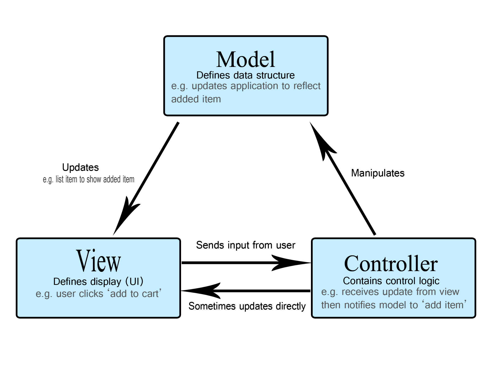

# C# Lessons
## 17.11.2025

# Contents
    - Linq
    - OOP
    - TDD
# Architecture

## Console Application
    - Models
        * Product.cs
        * Category.cs
    - Services
        * ProductService.cs
    - Utilities
        * DataSeeder.cs
    
## XUnit Tests (Console Application.Tests)
    - ProductServiceTests.cs
    - ProductTests.cs
